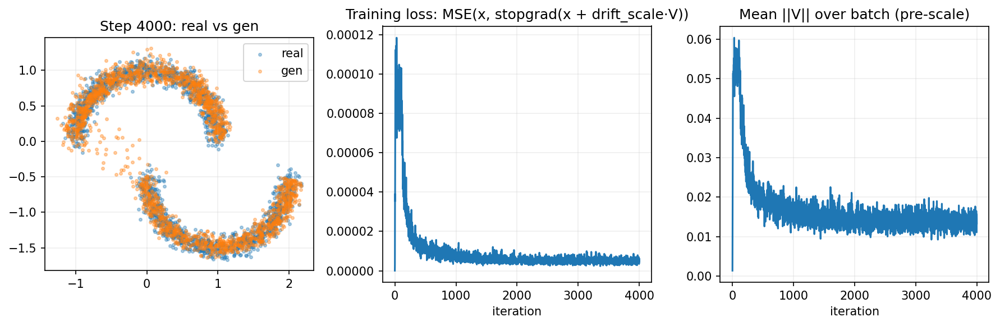

# Drifting Playground — Generative Modeling via Drifting

A minimal, readable implementation of the *core training idea* from **Generative Modeling via Drifting**:
a one-step generator trained by regressing to a **stop-gradient drifted target** computed from a **drifting field**.

This repo focuses on **toy 2D datasets** (two moons, spirals, Gaussian mixture), so you can understand and experiment with drifting
before scaling up to more complex settings.

---

## What this implements

At each training step:

1. Sample noise `z ~ N(0, I)` and generate `x = fθ(z)`.
2. Sample positives `y_pos ~ pdata` and use negatives `y_neg ~ qθ` (usually `y_neg = x`).
3. Compute drifting field `V(x, y_pos, y_neg, T)` (Algorithm 2).
4. Build a frozen drifted target: `x_target = stopgrad(x + drift_scale * V)`.
5. Minimize `MSE(x, x_target)`.

This matches the paper’s toy setup (Algorithm 1 / Algorithm 2) in spirit, with the same “double softmax” normalization used in their implementation.

---

## Repo layout

- `notebooks/drifting_experiments.ipynb`: interactive playground (generator + drift + training loop)
- `drifting_helpers/data.py`: datasets and samplers (kept out of the notebook)
- `drifting_helpers/plotting.py`: plotting utilities
- `drifting_helpers/io.py`: config loading (YAML/JSON)
- `configs/*.yaml`: experiment configs
- `scripts/train.py`: run training without the notebook (useful for reproducibility)

---

## Installation

```bash
git clone https://github.com/AhmedAbdelaal2001/drifting-playground.git
cd drifting-playground
pip install -r requirements.txt
````

> Tip (recommended): use a virtual environment (venv/conda) to avoid dependency conflicts.

---

## Quickstart

### Option A: Notebook (recommended)

Open `notebooks/drifting_experiments.ipynb`, then set the config path near the top of the notebook:

```python
CFG_PATH = "../configs/toy_drifting.yaml"
```

Run all cells. Outputs will be saved to the directory specified by `logging.run_dir` in the config.

### Option B: Script

```bash
python scripts/train.py --config configs/toy_drifting.yaml
```

---

## Outputs

After training, you should see images saved under `logging.run_dir`, e.g.:

* `dataset_preview.png`
* `state_step_000001.png`, `state_step_000400.png`, ...
* `final.png`

---

## Configuration guide

The most important knobs are:

* `drift.T` (temperature): higher = smoother drift, often more stable
* `drift.drift_scale`: higher = faster movement, but can overshoot
* `training.n_pos`: more positives reduces drift estimation noise
* `training.batch_size`: more negatives when using `y_neg = x`

### Troubleshooting

* If training diverges / samples explode: increase `drift.T`, reduce `drift.drift_scale`
* If training is slow: increase `drift.drift_scale` slightly, increase `training.steps`
* If you see mode dropping in GMM: increase `training.n_pos` and/or `training.batch_size`

---

## Results on Two Moons

### Training Step 0


### Training Step 4000



---

## Relation to the paper

* Implements a toy 2D version of the training loop (Alg. 1-style) and drifting field (Alg. 2).
* Uses the “double softmax + geometric mean” affinity normalization.
* Not included: large-scale/image experiments, encoders/latents, etc.

---

## Reproducibility

Runs are seeded via `system.seed`. Note that CUDA operations can still be nondeterministic on some GPUs/drivers.

---

## Extending

* Add a dataset: implement a sampler in `drifting_helpers/data.py`, then set `dataset.name` in a config.
* Change generator: edit `ToyGenerator` in the notebook or script.

---

## Citation / credit

If you use this repo, please cite the original paper: *Generative Modeling via Drifting*.

This repo is an educational toy implementation and is not affiliated with the authors.
